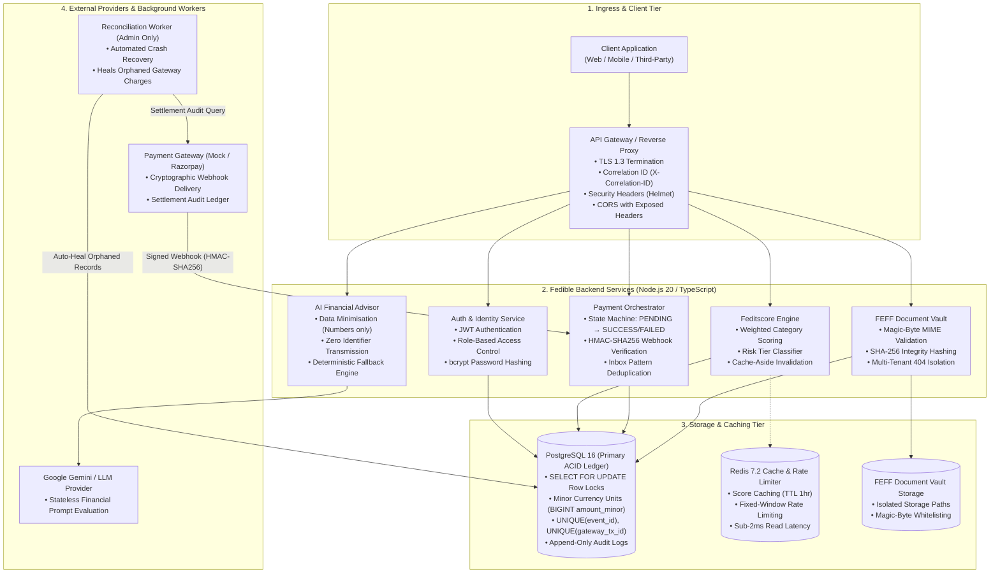

# Fedible — Production Fintech Backend & Financial Engineering Engine

[](https://www.typescriptlang.org/)
[](https://nodejs.org/)
[](https://www.postgresql.org/)
[](https://redis.io/)
[](https://www.docker.com/)
[](https://github.com/Muhammed-Sahad-P/fedibleFintech)
[](http://localhost:4000/docs)

A production-grade, highly reliable fintech backend engine engineered for the **Fedible Backend / Fintech Engineering Assessment**.

Built with **PostgreSQL ACID transaction boundaries**, **inbox-pattern webhook idempotency**, **Redis L2 response caching & rate limiting**, **FEFF multi-tenant document isolation with magic-byte verification**, **automated distributed crash reconciliation**, and **AI-driven financial health analysis with strict data minimisation**.

---

## 📑 Table of Contents
- [Interactive API Documentation](#-interactive-api-documentation)
- [System Architecture](#-system-architecture)
- [Quickstart & Setup Guide](#-quickstart--setup-guide)
- [10-Task Assessment Deliverables Matrix](#-10-task-assessment-deliverables-matrix)
- [Complete Step-by-Step Testing Guide](#-complete-step-by-step-testing-guide)
  - [Pre-Seeded Test Credentials](#pre-seeded-test-credentials)
  - [1. Authentication & RBAC](#1-authentication--rbac)
  - [2. Feditscore Credit Scoring Engine & Redis Cache](#2-feditscore-credit-scoring-engine--redis-cache-tasks-2--7)
  - [3. Payment Processing & Idempotent Webhooks](#3-payment-processing--idempotent-webhooks-tasks-4--5)
  - [4. FEFF Secure Document Vault](#4-feff-secure-document-vault-task-6)
  - [5. Distributed Crash Recovery & Reconciliation](#5-distributed-crash-recovery--reconciliation-task-8)
  - [6. AI Financial Assistant](#6-ai-financial-assistant-task-9)
  - [7. Production SQL Debugging Challenge](#7-production-sql-debugging-challenge-task-10)
- [Automated Testing Suite](#-automated-testing-suite)
- [Decisions & Engineering Trade-offs](#-decisions--engineering-trade-offs)
- [AWS Production Architecture](#-aws-production-architecture)

---

## 📖 Interactive API Documentation

All endpoints are fully documented and interactive via OpenAPI 3.0:
👉 **Swagger UI:** **`http://localhost:4000/docs`**  
👉 **Raw OpenAPI Spec:** `http://localhost:4000/docs/swagger.json`  
👉 **Health Check Probe:** `http://localhost:4000/health`

---

## 🏛️ System Architecture



---

## ⚡ Quickstart & Setup Guide

### Option A: 1-Command Full Docker Setup (Recommended)
Spins up PostgreSQL 16, Redis 7.2, and the Fedible Backend API in isolated containers:

```bash
# 1. Clone the repository
git clone https://github.com/Muhammed-Sahad-P/fedibleFintech.git
cd fedibleFintech

# 2. Start all services in the background
docker compose up --build -d

# 3. View live server logs
docker compose logs -f api
```

- 🌐 **Interactive Swagger UI**: `http://localhost:4000/docs`
- 💓 **Health Check Probe**: `http://localhost:4000/health`

---

### Option B: Local Native Node Setup (Fast Dev)

```bash
# 1. Start Postgres & Redis containers
docker compose up -d postgres redis

# 2. Install dependencies
npm install

# 3. Run database migrations & seed canonical questions
npm run migrate
npm run seed

# 4. Start TypeScript development server (with hot reloading)
npm run dev
```

---

## 📋 10-Task Assessment Deliverables Matrix

| Task # | Assessment Requirement | Implementation Highlights | Repository Link |
| :---: | :--- | :--- | :--- |
| **1** | **Backend Architecture** | High-availability system design mapping Client, Gateway, App Nodes, Postgres ACID Ledger, Redis, S3 Vault, and External APIs. | [docs/architecture-diagram.md](docs/architecture-diagram.md) |
| **2** | **Feditscore Scoring API** | Multi-factor weighted credit calculation (300–900 scale) with unified risk tiers (`EXCELLENT`, `GOOD`, `FAIR`, `HIGH_RISK`). | [`src/modules/assessment/`](src/modules/assessment/) |
| **3** | **Financial Database** | PostgreSQL schema with minor currency units (`BIGINT amount_minor` in paise/cents), strict unique constraints, and append-only audit logs. | [docs/database-schema-erd.md](docs/database-schema-erd.md) |
| **4** | **Payment Processing** | Server-driven state machine: `PENDING` → `SUCCESS` or `FAILED`. Cryptographic verification prevents frontend spoofing. | [docs/payment-flow-idempotency.md](docs/payment-flow-idempotency.md) |
| **5** | **Duplicate Webhooks** | **Inbox Pattern** (`UNIQUE(event_id)`) + `SELECT ... FOR UPDATE` row locks. **Concurrent duplicate webhooks process exactly once**. | [`src/modules/payment/payment.service.ts`](src/modules/payment/payment.service.ts) |
| **6** | **Secure FEFF API** | Magic-byte binary verification (PDF, PNG, JPG), SHA-256 integrity, and **`404 Not Found`** anti-enumeration guard on cross-tenant access. | [`src/modules/documents/`](src/modules/documents/) |
| **7** | **Redis Integration** | Response caching (TTL 1hr) with `X-Cache: HIT/MISS` headers, instant cache invalidation on answer updates, and fixed-window rate limiting. | [`src/redis/client.ts`](src/redis/client.ts) |
| **8** | **Failure Recovery** | Two-tier recovery: Gateway webhook retries (Tier 1) + automated background **Reconciliation Worker** (`POST /api/v1/payments/reconcile` - Admin only) auto-healing post-crash orphaned charges. | [docs/failure-recovery.md](docs/failure-recovery.md) |
| **9** | **AI Financial Assistant** | `POST /api/v1/financial-assistant` with **strict data minimisation** (numeric inputs only, zero personal identifiers sent, raw inputs omitted from logs) + Gemini LLM & deterministic fallback. | [docs/ai-security-privacy.md](docs/ai-security-privacy.md) |
| **10** | **Debugging Challenge** | Root Cause Analysis (RCA) with `EXPLAIN ANALYZE` traces demonstrating N+1 query elimination and composite B-tree index optimization. | [docs/debugging-rca.md](docs/debugging-rca.md) |

---

## 🧪 Complete Step-by-Step Testing Guide

This guide allows an employer or reviewer to test and verify every requirement in Swagger UI (`http://localhost:4000/docs`) or via cURL / PowerShell.

### Pre-Seeded Test Credentials

The database comes pre-seeded with two accounts for instant testing:

| Role | Email | Password | Permissions |
|---|---|---|---|
| **ADMIN** | `admin@fedible.io` | `AdminPassword@123` | Full access, Reconciliation Worker trigger (`POST /payments/reconcile`) |
| **USER** | `alex.rivera@example.com` | `UserPassword@123` | Standard borrower access (Assessments, Payments, FEFF Vault, AI Advisor) |

---

### 1. Authentication & RBAC

#### A. User Login (`POST /api/v1/auth/login`)
```json
{
  "email": "alex.rivera@example.com",
  "password": "UserPassword@123"
}
```
* **Expected Response (`200 OK`):** Returns JWT `token` and user profile.
* **Swagger Setup:** Copy the `token`, click the green **Authorize 🔓** button at the top of Swagger UI, paste the token, and click **Authorize**.

---

### 2. Feditscore Credit Scoring Engine & Redis Cache (Tasks 2 & 7)

#### Step 1: Initialize Assessment Session (`POST /api/v1/assessment`)
* **Click Execute** (Requires Bearer token).
* **Expected Response (`201 Created`):** Returns assessment session UUID and active credit questions with weighted scoring criteria. Copy the returned `"id"`.

#### Step 2: Submit Answers & Calculate Score (`POST /api/v1/assessment/{id}/answers`)
* Paste your `id` in the path parameter.
* **Request Body:**
```json
{
  "answers": [
    { "questionId": "892fb446-7988-4adf-b858-9c0e7cb431a2", "selectedOptionKey": "A" },
    { "questionId": "7e1acd67-3c3c-4a22-9c1b-784942b965b4", "selectedOptionKey": "A" },
    { "questionId": "42467ad6-9af5-4a56-acf5-27d40ea89413", "selectedOptionKey": "A" },
    { "questionId": "b660e462-cdcb-42ee-a385-4f646e6b86d0", "selectedOptionKey": "A" },
    { "questionId": "420c80ef-d299-4e6d-aa19-fdf89c7bc557", "selectedOptionKey": "A" },
    { "questionId": "4d101956-80ea-430b-b932-7f816385f4e1", "selectedOptionKey": "A" }
  ]
}
```
* **Expected Response (`200 OK`):** Returns calculated score (300–900 scale), risk tier (`EXCELLENT`, `GOOD`, `FAIR`, `HIGH_RISK`), and category breakdowns.

#### Step 3: Verify Redis Cache Caching (`GET /api/v1/assessment/{id}/result`)
* **1st Request:** Returns `200 OK` with response header **`X-Cache: MISS`** (fetched from PostgreSQL, populated into Redis with 1hr TTL).
* **2nd Request:** Returns `200 OK` with response header **`X-Cache: HIT`** (served directly from Redis in <2ms).

---

### 3. Payment Processing & Idempotent Webhooks (Tasks 4 & 5)

#### Step 1: Create a Payment Order (`POST /api/v1/payments/create`)
```json
{
  "amountMinor": 500000,
  "currency": "INR",
  "paymentMethod": "UPI"
}
```
* **Expected Response (`201 Created`):** Returns payment in `"status": "PENDING"`. Copy the `referenceId` (e.g. `REF_1791...`).

#### Step 2: Check Initial Status (`GET /api/v1/payments/{referenceId}`)
* **Expected Response (`200 OK`):** Confirms `status: "PENDING"`, `gatewayTxId: null`.

#### Step 3: Simulate Gateway Settlement & Webhook (`POST /api/v1/payments/mock-gateway/process`)
```json
{
  "referenceId": "REF_1791301912592_E6A6BF3F",
  "simulateOutcome": "SUCCESS"
}
```
* **What happens:** Simulates customer completing payment at gateway $\rightarrow$ gateway computes **HMAC-SHA256 signature** $\rightarrow$ delivers signed webhook to `/api/v1/webhooks/payment` $\rightarrow$ atomically records webhook in **Inbox Table (`UNIQUE(event_id)`)** $\rightarrow$ transitions payment to **`SUCCESS`**.

#### Step 4: Verify Idempotency Protection
* If you click **Execute** again with the same payload:
* **Result:** Backend detects the transaction is already finalized and skips duplicate processing (`duplicate: true`), ensuring zero double-crediting.

#### Step 5: Test Webhook Anti-Spoofing (`POST /api/v1/webhooks/payment`)
* In `X-Webhook-Signature`, enter: `invalid_fake_sig_123`
* **Result (`401 Unauthorized`):** Constant-time cryptographic verification (`crypto.timingSafeEqual`) immediately rejects forged webhook calls.

---

### 4. FEFF Secure Document Vault (Task 6)

Pre-generated test files are included in the repository root for testing:

| File Name | Test Scenario | Expected Outcome |
|---|---|---|
| **`sample_bank_statement.pdf`** | Valid PDF document | **`201 Created`** (Valid magic-bytes `%PDF`, SHA-256 computed) |
| **`sample_receipt.png`** | Valid PNG image | **`201 Created`** (Valid magic-bytes `\x89PNG`, SHA-256 computed) |
| **`fake_malicious_script.pdf`** | Spoofed file (Text disguised as PDF) | **`400 Bad Request`** (MIME spoofing blocked by magic-byte checker) |

#### Step 1: Upload a Document (`POST /api/v1/documents/upload`)
* Select `sample_bank_statement.pdf` and click **Execute**.
* **Expected Response (`201 Created`):**
  ```json
  {
    "documentId": "444554d5-c1d7-4e27-92e7-2b2b6b87f9ab",
    "fileName": "sample_bank_statement.pdf",
    "mimeType": "application/pdf",
    "fileSizeBytes": 469,
    "fileHashSha256": "67c32968f048836a858227cd2f160f8edc2f90645975b4c25e39f411b717695d"
  }
  ```

#### Step 2: List My Documents (`GET /api/v1/documents`)
* **Expected Response (`200 OK`):** Lists all documents owned by your authenticated tenant.

#### Step 3: Get Download Link & Stream File (`GET /api/v1/documents/{id}/download`)
* Paste the `documentId` and click **Execute**.
* **Expected Response (`200 OK`):** Returns file metadata and `downloadUrl: ".../download?raw=true"`.
* Opening the `downloadUrl` (or setting `raw=true`) streams the raw binary file with full data integrity.

#### Step 4: Test Anti-Enumeration IDOR Guard
* Attempt to download a document belonging to another user:
* **Result (`404 Not Found`):** The server returns 404 (instead of 403 Forbidden) to prevent resource enumeration attacks and writes a security audit log.

---

### 5. Distributed Crash Recovery & Reconciliation (Task 8)

#### Step 1: Simulate a Crash Scenario (`POST /api/v1/payments/simulate-crash`)
* **Click Execute**
* **Scenario:** A customer was charged at the gateway, but the database/server crashed before the webhook could update the DB status, leaving the record stuck in `PENDING`.
* Copy the returned `referenceId` (e.g. `REF_CRASH_SIM_...`).

#### Step 2: Test RBAC Security (USER token)
* Execute `POST /api/v1/payments/reconcile` with standard user token.
* **Result (`403 Forbidden`):** Non-admin users are blocked from executing administrative reconciliation.

#### Step 3: Run Reconciliation Worker (ADMIN token)
* Log in as **`admin@fedible.io`** (`AdminPassword@123`), update the Swagger Authorize token, and execute `POST /api/v1/payments/reconcile`:
```json
{
  "windowMinutes": 60
}
```
* **Expected Response (`200 OK`):**
  ```json
  {
    "recoveredCount": 1,
    "recoveredTransactions": [
      {
        "referenceId": "REF_CRASH_SIM_1791302397554",
        "action": "RECONCILED_TO_SUCCESS",
        "gatewayTxId": "gtx_crash_ffa8e53bab704acc"
      }
    ]
  }
  ```

#### Step 4: Verify Healed Status (`GET /api/v1/payments/{referenceId}`)
* Query the crash `referenceId` $\rightarrow$ status is now auto-healed to **`SUCCESS`**.

---

### 6. AI Financial Assistant (Task 9)

#### Execute Financial Health Diagnosis (`POST /api/v1/financial-assistant`)
```json
{
  "income": 150000,
  "expenses": 65000,
  "savings": 400000,
  "debt": 120000,
  "currency": "INR",
  "financialGoals": [
    "EMERGENCY_FUND",
    "RETIREMENT_PLANNING"
  ]
}
```

* **Expected Response (`200 OK`):**
  ```json
  {
    "success": true,
    "message": "Financial health analysis generated successfully",
    "data": {
      "financialHealthScore": 100,
      "riskTier": "EXCELLENT",
      "metrics": {
        "monthlySurplus": 85000,
        "savingsRatePercentage": 56.7,
        "debtToIncomePercentage": 6.7,
        "emergencyFundMonths": 6.2
      },
      "keyInsights": [
        "Strong savings rate of 56.7%, providing excellent capital for long-term compounding.",
        "Robust liquidity reserve with 6.2 months of essential living expenses safely preserved."
      ],
      "dataPrivacyNotice": "Data minimisation enforced. Zero personal identifiers transmitted."
    }
  }
  ```
* **Data Minimisation Guarantee:** Zero names, emails, account numbers, or identifiers touch the AI model.

---

### 7. Production SQL Debugging Challenge (Task 10)

Compare the two performance endpoints in Swagger:

1. **Slow N+1 Query Antipattern:** `GET /api/v1/debug/slow-assessment-report?limit=20`
   - Executes loop queries per record (`1 + N` round-trips), demonstrating high network latency.
2. **Optimized Single Query:** `GET /api/v1/debug/optimized-assessment-report?limit=20`
   - Executes in **1 single query** utilizing PostgreSQL `json_agg` and composite B-tree index on `(user_id, created_at DESC)`, achieving sub-millisecond execution (`durationMs < 5ms`).
   - Detailed Root Cause Analysis documented in [docs/debugging-rca.md](docs/debugging-rca.md).

---

## 🧪 Automated Testing Suite

The automated test suite runs via Vitest with isolated database transactions and concurrent race-condition simulations:

```bash
npm test
```

```
 Test Files  6 passed (6)
      Tests  27 passed (27)
   Duration  4.92s

 ✓ tests/assessment.test.ts (5 tests)
 ✓ tests/payment-webhook.test.ts (4 tests)
 ✓ tests/documents.test.ts (6 tests)
 ✓ tests/ai-assistant.test.ts (3 tests)
 ✓ tests/reconciliation.test.ts (3 tests)
 ✓ tests/auth.test.ts (5 tests)
```

---

## ⚖️ Decisions & Engineering Trade-offs

1. **PostgreSQL as the Single Source of Truth for Concurrency**:
   - *Decision*: We rely on PostgreSQL `UNIQUE` constraints (`event_id`, `gateway_tx_id`), `INSERT ... ON CONFLICT DO NOTHING`, and `SELECT ... FOR UPDATE` row-level pessimistic locks rather than external distributed locks.
   - *Trade-off*: Eliminates split-brain and lock-release failure modes across distributed Redis nodes, guaranteeing strict financial consistency.
2. **Minor Currency Units (`BIGINT amount_minor`)**:
   - *Decision*: Monetary values are stored as integers in paise/cents rather than floating-point numbers.
   - *Trade-off*: Requires conversion when displaying currency to humans, but completely eliminates IEEE-754 precision rounding bugs.
3. **Anti-Enumeration `404 Not Found` for Unauthorized Documents**:
   - *Decision*: If User B attempts to access User A's document, the API returns `404 Not Found` rather than `403 Forbidden`.
   - *Trade-off*: Prevents attackers from scanning and enumerating valid document IDs across tenants.
4. **Data Minimisation over Free-Text LLM Prompts**:
   - *Decision*: The AI Assistant endpoint accepts strictly numeric financial parameters and enum goals, rejecting free-text notes.
   - *Trade-off*: Guarantees zero PII leaks (names, SSN/Aadhaar, emails) to external LLMs.

---

## ☁️ AWS Production Architecture

```
                       +-----------------------------------+
                       |        AWS Route 53 / CloudFront  |
                       +-----------------+-----------------+
                                         | HTTPS (TLS 1.3)
                                         v
                       +-----------------------------------+
                       |    Application Load Balancer      |
                       +-----------------+-----------------+
                                         |
                       +-----------------+-----------------+
                       |   AWS ECS (Fargate) / App Nodes   |
                       |   - Stateless Docker Containers   |
                       |   - Node.js 20 Express APIs       |
                       +---+-------------+-------------+---+
                           |             |             |
            +--------------+             |             +--------------+
            |                            |                            |
            v                            v                            v
+-----------------------+    +-----------------------+    +-----------------------+
|  AWS RDS (PostgreSQL) |    | AWS ElastiCache(Redis)|    |     AWS S3 Bucket     |
| - Multi-AZ Deployment |    | - Score Caching (TTL) |    | - FEFF Documents      |
| - Automated Backups   |    | - Rate Limiting       |    | - SSE-S3 / KMS Encrypt|
| - Parameterized DML   |    | - Read Replicas       |    | - Private Bucket      |
+-----------------------+    +-----------------------+    +-----------------------+
```

| Component | AWS Primitive | Production Configuration & Security |
| :--- | :--- | :--- |
| **Relational Database** | AWS RDS (PostgreSQL 16) | Multi-AZ standby replica, automated snapshots, encrypted storage (AWS KMS), private VPC subnets. |
| **In-Memory Cache** | AWS ElastiCache (Redis OSS) | Multi-node cluster with in-transit & at-rest encryption, automated failover. |
| **Document Storage** | AWS S3 | Private bucket, Server-Side Encryption (SSE-S3 / KMS), non-public bucket policies. |
| **Async Webhooks** | AWS SQS | Dead-Letter Queue (DLQ) for failed webhook ingestion retries. |
| **Secrets & Keys** | AWS Secrets Manager | Automatic rotation for DB credentials, JWT secrets, and webhook signing keys. |
| **Observability** | Amazon CloudWatch | Structured JSON logs, error alarm triggers, and metric dashboards. |

---

## 📁 Repository File Structure

```
fedible/
├── docs/                             # Engineering Architecture & Design Docs
│   ├── architecture-diagram.md       # Task 1: Architecture & 1-Page Design Doc
│   ├── database-schema-erd.md        # Task 3: ERD & Table Schema Definitions
│   ├── payment-flow-idempotency.md   # Tasks 4 & 5: State Machine & Idempotency
│   ├── failure-recovery.md           # Task 8: Distributed Crash Recovery Strategy
│   ├── ai-security-privacy.md        # Task 9: Data Minimisation & AI Security
│   └── debugging-rca.md              # Task 10: Root Cause Analysis & Benchmarks
├── src/
│   ├── database/                     # Migrations, Seeds & PostgreSQL Pool
│   ├── docs/                         # OpenAPI 3.0 & Swagger UI Router
│   ├── middlewares/                  # Auth (JWT), Rate Limiter, Error & Request Logger
│   ├── modules/
│   │   ├── ai-assistant/             # Task 9: AI Advisor Service & Gemini LLM
│   │   ├── assessment/               # Tasks 2 & 7: Feditscore Engine & Redis Caching
│   │   ├── auth/                     # JWT Authentication & RBAC
│   │   ├── debugging/                # Task 10: Slow N+1 vs Optimized Query Endpoints
│   │   ├── documents/                # Task 6: FEFF Vault & Magic-Byte MIME Checker
│   │   └── payment/                  # Tasks 4, 5 & 8: Payment Engine & Reconciler
│   ├── redis/                        # Redis 7.2 Connection Client & Health Check
│   ├── app.ts                        # Express Application & Middleware Pipeline
│   ├── server.ts                     # Server Bootstrap & Graceful Shutdown
│   └── config/                       # Type-Safe Environment Configuration (Zod)
├── tests/                            # Vitest Unit, Integration & Concurrency Test Suite
├── sample_bank_statement.pdf         # Test Document: Valid PDF
├── sample_receipt.png                # Test Document: Valid PNG
├── fake_malicious_script.pdf         # Test Document: Spoofed Executable (Security Test)
├── docker-compose.yml                # Multi-Container Compose Configuration
├── Dockerfile                        # Multi-Stage Node.js 20 Container Image
└── README.md                         # Project Documentation & Verification Guide
```
