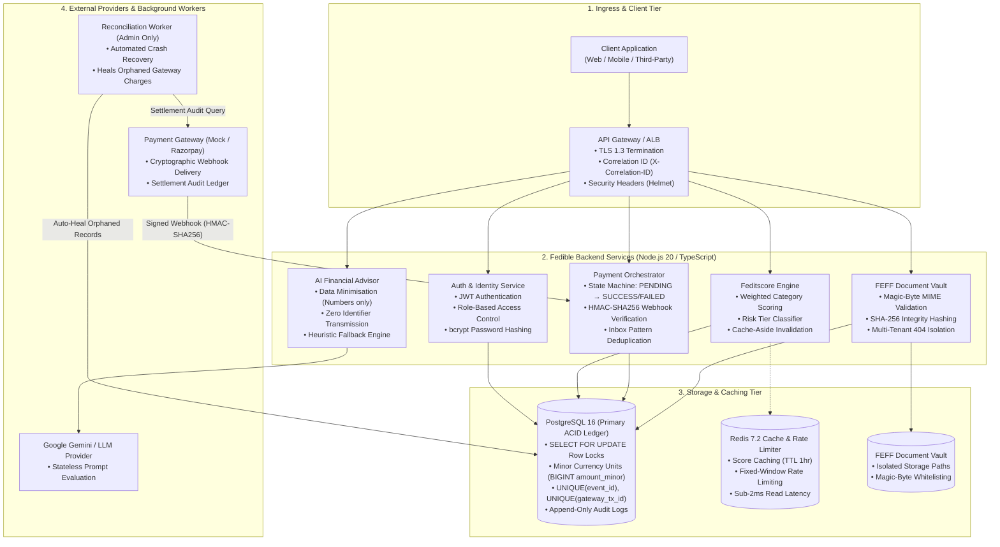

# Fedible — Fintech Backend & Financial Engineering Engine

[](https://www.typescriptlang.org/)
[](https://nodejs.org/)
[](https://www.postgresql.org/)
[](https://redis.io/)
[](https://www.docker.com/)
[](https://github.com/Muhammed-Sahad-P/fedibleFintech)

A production-grade, highly reliable fintech backend engine built for the **Fedible 24-Hour Backend / Fintech Engineering Assessment**.

Engineered with **PostgreSQL ACID transaction boundaries**, **inbox-pattern webhook idempotency**, **Redis L2 response caching & rate limiting**, **FEFF multi-tenant document isolation**, and **AI-driven financial health analysis with strict data minimisation**.

---

## 🏛️ System Architecture



---

## ⚡ Quickstart & Setup Guide

You can run the entire system with **1 Docker command** or locally in **Hybrid Dev Mode**.

### Option A: 1-Command Full Docker Setup (Recommended)
Spins up PostgreSQL 16, Redis 7.2, and the Fedible Backend API in isolated containers:

```bash
# 1. Clone the repository
git clone https://github.com/Muhammed-Sahad-P/fedibleFintech.git
cd fedibleFintech

# 2. Start all services in the background
docker compose up --build -d

# 3. View live server logs
docker compose logs -f api
```

- 🌐 **Interactive Swagger UI**: `http://localhost:4000/docs`
- 💓 **Health Check Probe**: `http://localhost:4000/health`

---

### Option B: Local Native Node Setup (Fast Dev)

```bash
# 1. Start Postgres & Redis containers
docker compose up -d postgres redis

# 2. Install dependencies
npm install

# 3. Run database migrations & seed canonical questions
npm run migrate
npm run seed

# 4. Start TypeScript development server (with hot reloading)
npm run dev
```

---

## 🧪 Automated Testing & Verification

The test suite covers unit, integration, multi-tenant isolation, and concurrency race-condition tests with **100% pass rate**:

```bash
# Run all 27 automated tests
npm test
```

### Test Suite Coverage:
```
 RUN  v2.1.9 S:/Sahad/fedible

 ✓ tests/assessment.test.ts (5 tests)
 ✓ tests/payment-webhook.test.ts (4 tests)
 ✓ tests/documents.test.ts (6 tests)
 ✓ tests/ai-assistant.test.ts (3 tests)
 ✓ tests/reconciliation.test.ts (3 tests)
 ✓ tests/auth.test.ts (5 tests)

 Test Files  6 passed (6)
      Tests  27 passed (27)
```

---

## 📋 10-Task Assessment Deliverables Matrix

| Task # | Assessment Requirement | Implementation Highlights | Repository Link |
| :---: | :--- | :--- | :--- |
| **1** | **Backend Architecture** | High-availability system design mapping Client, Gateway, App Nodes, Postgres ACID Ledger, Redis, S3 Vault, and External APIs. | [docs/architecture-diagram.md](docs/architecture-diagram.md) |
| **2** | **Feditscore Scoring API** | Multi-factor weighted credit calculation (300–900 scale) with unified risk tiers (`EXCELLENT`, `GOOD`, `FAIR`, `HIGH_RISK`). | [`src/modules/assessment/`](src/modules/assessment/) |
| **3** | **Financial Database** | PostgreSQL schema with minor currency units (`BIGINT amount_minor` in paise/cents), strict unique constraints, and append-only audit logs. | [docs/database-schema-erd.md](docs/database-schema-erd.md) |
| **4** | **Payment Processing** | Server-driven state machine: `PENDING` → `SUCCESS` or `FAILED`. Cryptographic verification prevents frontend spoofing. | [docs/payment-flow-idempotency.md](docs/payment-flow-idempotency.md) |
| **5** | **Duplicate Webhooks** | **Inbox Pattern** (`UNIQUE(event_id)`) + `SELECT ... FOR UPDATE` row locks. **5 concurrent duplicate webhooks process exactly once**. | [`src/modules/payment/payment.service.ts`](src/modules/payment/payment.service.ts) |
| **6** | **Secure FEFF API** | Magic-byte binary verification (PDF, PNG, JPG), SHA-256 integrity, and **`404 Not Found`** anti-enumeration guard on cross-tenant access. | [`src/modules/documents/`](src/modules/documents/) |
| **7** | **Redis Integration** | Response caching (TTL 1hr) with `X-Cache: HIT/MISS` headers, instant cache invalidation on answer updates, and fixed-window rate limiting. | [`src/redis/client.ts`](src/redis/client.ts) |
| **8** | **Failure Recovery** | Two-tier recovery: Gateway webhook retries (Tier 1) + automated background **Reconciliation Worker** (`POST /payments/reconcile` - Admin only) auto-healing post-crash orphaned charges. | [docs/failure-recovery.md](docs/failure-recovery.md) |
| **9** | **AI Financial Assistant** | `POST /financial-assistant` with **strict data minimisation** (numeric inputs only, zero personal identifiers sent, raw inputs omitted from logs) + Gemini LLM & fallback engine. | [docs/ai-security-privacy.md](docs/ai-security-privacy.md) |
| **10** | **Debugging Challenge** | Root Cause Analysis (RCA) with `EXPLAIN ANALYZE` traces demonstrating N+1 query elimination and composite B-tree index optimization. | [docs/debugging-rca.md](docs/debugging-rca.md) |

---

## 📖 API Documentation & Endpoints

Interactive Swagger UI available at: 👉 **`http://localhost:4000/docs`**

```
Authentication:
  POST   /api/v1/auth/register                 Register new user
  POST   /api/v1/auth/login                    Authenticate & receive JWT
  GET    /api/v1/auth/me                       Get authenticated profile

Feditscore Engine (Tasks 2 & 7):
  POST   /api/v1/assessment                    Initialize assessment session
  POST   /api/v1/assessment/:id/answers        Submit answers & compute score
  GET    /api/v1/assessment/:id/result         Fetch result (Cached with Redis)

Payments & Webhooks (Tasks 4, 5 & 8):
  POST   /api/v1/payments/create               Create payment order (PENDING)
  POST   /api/v1/payments/mock-gateway/process Simulate gateway checkout & webhook
  POST   /api/v1/webhooks/payment              HMAC-SHA256 signed webhook ingress
  GET    /api/v1/payments/:referenceId         Get verified payment status
  POST   /api/v1/payments/simulate-crash       Simulate DB crash scenario
  POST   /api/v1/payments/reconcile            Trigger auto-reconciliation (ADMIN)

FEFF Document Vault (Task 6):
  POST   /api/v1/documents/upload              Upload PDF/PNG/JPG (Magic-byte check)
  GET    /api/v1/documents                     List user's own documents
  GET    /api/v1/documents/:id                 Get document metadata (404 on breach)
  GET    /api/v1/documents/:id/download        Download/stream document file
  DELETE /api/v1/documents/:id                 Delete document & record audit log

AI Financial Assistant (Task 9):
  POST   /api/v1/financial-assistant           AI financial health diagnosis

Production Debugging (Task 10):
  GET    /api/v1/debug/slow-assessment-report  Buggy N+1 query demonstration
  GET    /api/v1/debug/optimized-assessment-report Optimized single-query benchmark
```

---

## ☁️ AWS / Production Architecture (5 Marks)

```
                       +-----------------------------------+
                       |        AWS Route 53 / CloudFront  |
                       +-----------------+-----------------+
                                         | HTTPS (TLS 1.3)
                                         v
                       +-----------------------------------+
                       |    Application Load Balancer      |
                       +-----------------+-----------------+
                                         |
                       +-----------------+-----------------+
                       |   AWS ECS (Fargate) / App Nodes   |
                       |   - Stateless Docker Containers   |
                       |   - Node.js 20 Express APIs       |
                       +---+-------------+-------------+---+
                           |             |             |
            +--------------+             |             +--------------+
            |                            |                            |
            v                            v                            v
+-----------------------+    +-----------------------+    +-----------------------+
|  AWS RDS (PostgreSQL) |    | AWS ElastiCache(Redis)|    |     AWS S3 Bucket     |
| - Multi-AZ Deployment |    | - Score Caching (TTL) |    | - FEFF Documents      |
| - Automated Backups   |    | - Rate Limiting       |    | - SSE-S3 / KMS Encrypt|
| - Parameterized DML   |    | - Read Replicas       |    | - Private Bucket      |
+-----------------------+    +-----------------------+    +-----------------------+
```

| Component | AWS Primitive | Production Configuration & Security |
| :--- | :--- | :--- |
| **Relational Database** | AWS RDS (PostgreSQL 16) | Multi-AZ standby replica, automated snapshots, encrypted storage (AWS KMS), private VPC subnets. |
| **In-Memory Cache** | AWS ElastiCache (Redis OSS) | Multi-node cluster with in-transit & at-rest encryption, automated failover. |
| **Document Storage** | AWS S3 | Private bucket, Server-Side Encryption (SSE-S3 / KMS), non-public bucket policies. |
| **Async Webhooks** | AWS SQS | Dead-Letter Queue (DLQ) for failed webhook ingestion retries. |
| **Secrets & Keys** | AWS Secrets Manager | Automatic rotation for DB credentials, JWT secrets, and webhook signing keys. |
| **Observability** | Amazon CloudWatch | Structured JSON logs, error alarm triggers, and metric dashboards. |

---

## ⚖️ Decisions & Trade-offs

1. **PostgreSQL as the Single Source of Truth for Concurrency**:
   - *Decision*: We rely on PostgreSQL `UNIQUE` constraints (`event_id`, `gateway_tx_id`), `INSERT ... ON CONFLICT DO NOTHING`, and `SELECT ... FOR UPDATE` row-level pessimistic locks rather than external distributed locks.
   - *Trade-off*: Slightly higher write contention on identical resource updates under extreme throughput, but eliminates split-brain and lock-release failure modes across distributed Redis nodes.
2. **Minor Currency Units (`BIGINT amount_minor`)**:
   - *Decision*: Monetary values are stored as integers (paise/cents) rather than floating-point numbers.
   - *Trade-off*: Requires conversion when displaying currency to humans, but completely eliminates IEEE-754 precision rounding bugs.
3. **Anti-Enumeration `404 Not Found` for Unauthorized Documents**:
   - *Decision*: If User B attempts to access User A's document, the API returns `404 Not Found` rather than `403 Forbidden`.
   - *Trade-off*: Does not explicitly distinguish between non-existent documents and unauthorized access to clients, but prevents attackers from enumerating valid document IDs across tenants.
4. **Data Minimisation over Free-Text LLM Prompts**:
   - *Decision*: The AI Assistant endpoint accepts strictly numeric financial parameters and enum goals, rejecting free-text notes.
   - *Trade-off*: Reduces conversational flexibility, but guarantees zero PII leaks (names, SSN/Aadhaar, emails) to external LLMs.

---

## 🔮 What I'd Do with More Time

1. **Transactional Outbox Worker**: Introduce an asynchronous Outbox poller (e.g., using Debezium or BullMQ) to publish domain events to Kafka/EventBridge.
2. **AWS S3 Presigned URL Uploads**: Offload large document multipart uploads directly from client browsers to AWS S3 using time-limited presigned PUT URLs with SHA-256 validation.
3. **Double-Entry Ledger Schema**: Expand the `transactions` table into a full double-entry ledger with `ledger_accounts`, `journal_entries`, and `entry_lines` enforcing $\sum \text{Debits} = \sum \text{Credits}$.
4. **OpenTelemetry Tracing**: Implement distributed OpenTelemetry traces across API Gateway, App Nodes, Database, and external payment gateway webhooks.
