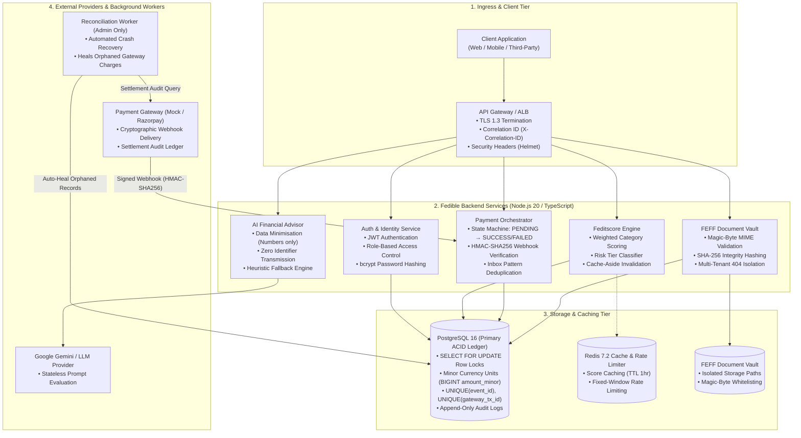

# Task 1: Fedible Backend Architecture & System Design

## 1. System Architecture Diagram

---

## 2. 1-Page Architectural Specification

### 2.1 Overview & System Purpose
The Fedible backend is designed to provide real-time credit risk assessment (**Feditscore**), secure financial document management (**FEFF**), idempotent payment orchestration, and AI-driven financial analysis. The system is architected for financial reliability, deterministic state transitions, strict multi-tenant isolation, and sub-millisecond response caching.

---

### 2.2 Core Component Boundaries

1. **Authentication & Identity Service**:
   - Manages stateless user identity using JSON Web Tokens (JWT) signed with HMAC-SHA256.
   - Passwords are salted and hashed using `bcrypt` (10 rounds).
   - Enforces Role-Based Access Control (`USER`, `ADMIN`).

2. **Feditscore Scoring Engine**:
   - Evaluates weighted financial attributes across four critical pillars: **Debt-to-Income**, **Liquidity Reserves**, **Savings Rate**, and **Fixed Obligation Ratio**.
   - Generates a normalized financial health score (range: 300 to 900) and maps users into standardized risk tiers (`EXCELLENT`, `GOOD`, `FAIR`, `HIGH_RISK`).
   - Integrates with Redis in a **Cache-Aside** architecture with automatic invalidation upon answer submissions.

3. **Payment Processing & Webhook Deduplication**:
   - Manages an explicit financial state machine: `PENDING` $\rightarrow$ `SUCCESS` or `FAILED`.
   - Protects against duplicate webhook deliveries using the **Inbox Pattern** (`webhook_events` with `UNIQUE(event_id)`) and database pessimistic row locks (`SELECT ... FOR UPDATE`).
   - Uses an automated **Reconciliation Worker** as a backup safety net to detect and recover orphaned gateway transactions following system crashes.

4. **FEFF (Financial Evidence & File Facility)**:
   - Manages user-uploaded financial documentation (bank statements, salary slips, tax filings).
   - Validates file headers via magic-byte inspection to prevent MIME spoofing, calculates SHA-256 integrity checksums, and stores files with isolated UUID paths.
   - Enforces strict multi-tenant authorization, returning `404 Not Found` for unauthorized lookups to prevent resource enumeration.

5. **AI Financial Assistant**:
   - Accepts sanitized numeric parameters (`income`, `expenses`, `savings`, `debt`) and fixed enum goals.
   - Applies strict data minimisation: transmits **zero personal identifiers** to third-party LLMs and includes an offline deterministic fallback engine.

---

### 2.3 Data Integrity & Concurrency Philosophy
In fintech systems, **PostgreSQL is the single source of truth for correctness**:
- All financial balances and charges are stored as `BIGINT amount_minor` (paise/cents) to eliminate IEEE-754 floating-point drift.
- Duplicate prevention is guaranteed by database-level `UNIQUE` constraints and atomic conditional inserts (`ON CONFLICT DO NOTHING`).
- State mutations execute within explicit ACID transactions with row-level locks (`SELECT ... FOR UPDATE`), ensuring that concurrent requests cannot trigger race conditions.

---

### 2.4 Caching, Performance & Rate Limiting
- **Redis 7.2** is utilized strictly for non-critical performance optimizations:
  - Caching assessment calculation results with 1-hour TTLs, reducing database load on repeated queries.
  - Fixed-window rate limiting per IP / User ID to protect sensitive authentication, payment, and AI endpoints against abuse.
  - The application is designed to fail open gracefully if Redis experiences temporary outages.

---

### 2.5 Failure Domains & Disaster Recovery
- **Database Crash / Ingress Outage**: The payment gateway's automated retry schedule safely retries webhooks once the database recovers. The background reconciler audits settled gateway records against database transactions to heal any orphaned payments.
- **Audit Immutability**: All security violations (unauthorized document access attempts, duplicate webhooks, reconciliation events) are appended to an immutable `audit_logs` table for forensic analysis.
