# Task 3: Financial Database Schema & ER Diagram

## 1. Entity Relationship Diagram (ERD)

```mermaid
erDiagram
    USERS ||--o{ ASSESSMENTS : "takes"
    USERS ||--o{ TRANSACTIONS : "initiates"
    USERS ||--o{ DOCUMENTS : "owns"
    USERS ||--o{ AUDIT_LOGS : "acts"

    ASSESSMENTS ||--|{ ANSWERS : "contains"
    ASSESSMENTS ||--o{ SCORES : "yields"
    QUESTIONS ||--o{ ANSWERS : "referenced_by"

    TRANSACTIONS ||--o{ WEBHOOK_EVENTS : "reconciles_with"

    USERS {
        uuid id PK "DEFAULT uuid_generate_v4()"
        varchar email UK "Unique email address"
        varchar password_hash "bcrypt hashed password"
        varchar full_name "User legal name"
        varchar role "USER | ADMIN"
        timestamptz created_at
        timestamptz updated_at
    }

    ASSESSMENTS {
        uuid id PK "DEFAULT uuid_generate_v4()"
        uuid user_id FK "REFERENCES users(id) ON DELETE CASCADE"
        varchar status "IN_PROGRESS | COMPLETED | EXPIRED"
        integer total_score "Credit score (300 - 900)"
        varchar risk_tier "EXCELLENT | GOOD | FAIR | HIGH_RISK"
        jsonb score_breakdown "Full scoring calculation breakdown"
        timestamptz completed_at
        timestamptz created_at
        timestamptz updated_at
    }

    QUESTIONS {
        uuid id PK "DEFAULT uuid_generate_v4()"
        varchar code UK "Canonical code (e.g. DEBT_TO_INCOME)"
        text prompt "Question text"
        varchar category "DEBT | LIQUIDITY | SAVINGS | EXPENSES"
        integer weight "Category weighting factor"
        jsonb options "Array of options [{key, label, score}]"
        boolean is_active "Active question flag"
        timestamptz created_at
    }

    ANSWERS {
        uuid id PK "DEFAULT uuid_generate_v4()"
        uuid assessment_id FK "REFERENCES assessments(id) ON DELETE CASCADE"
        uuid question_id FK "REFERENCES questions(id) ON DELETE CASCADE"
        varchar selected_option_key "Option selected (e.g. A, B)"
        integer score_value "Numeric score value awarded"
        timestamptz created_at
    }

    SCORES {
        uuid id PK "DEFAULT uuid_generate_v4()"
        uuid assessment_id FK "REFERENCES assessments(id) ON DELETE CASCADE"
        varchar category "Category name"
        integer category_score "Earned category score"
        integer max_score "Maximum possible category score"
        jsonb metadata "Category calculation metadata"
        timestamptz created_at
    }

    TRANSACTIONS {
        uuid id PK "DEFAULT uuid_generate_v4()"
        varchar reference_id UK "Fedible internal reference ID"
        uuid user_id FK "REFERENCES users(id) ON DELETE CASCADE"
        bigint amount_minor "Amount in minor currency units (paise/cents)"
        varchar currency "ISO currency code (INR, USD)"
        varchar status "PENDING | SUCCESS | FAILED"
        varchar payment_method "Payment rail (UPI, CARD, NETBANKING)"
        varchar gateway_tx_id UK "Payment gateway transaction ID"
        varchar idempotency_key UK "Client idempotency key"
        jsonb metadata "Transaction metadata"
        timestamptz created_at
        timestamptz updated_at
    }

    DOCUMENTS {
        uuid id PK "DEFAULT uuid_generate_v4()"
        uuid user_id FK "REFERENCES users(id) ON DELETE CASCADE"
        varchar file_name "Original uploaded file name"
        varchar mime_type "Verified MIME type (application/pdf, image/png)"
        bigint file_size_bytes "Size of file in bytes"
        varchar storage_path "Secure isolated storage path"
        varchar file_hash_sha256 "SHA-256 cryptographic checksum"
        timestamptz created_at
        timestamptz updated_at
    }

    WEBHOOK_EVENTS {
        uuid id PK "DEFAULT uuid_generate_v4()"
        varchar event_id UK "Unique gateway event identifier"
        varchar event_type "Event type (payment.succeeded, payment.failed)"
        varchar provider "Gateway provider (MOCK_GATEWAY, RAZORPAY)"
        jsonb raw_payload "Unmodified webhook JSON payload"
        varchar processing_status "RECEIVED | PROCESSED | FAILED | DUPLICATE"
        integer retry_count "Number of processing attempts"
        timestamptz processed_at
        timestamptz created_at
    }

    AUDIT_LOGS {
        uuid id PK "DEFAULT uuid_generate_v4()"
        uuid actor_id FK "User or system actor initiating action"
        varchar entity_type "DOCUMENT | PAYMENT | ASSESSMENT | SECURITY"
        varchar entity_id "Target entity ID"
        varchar action "CREATE | UPDATE | UNAUTHORIZED_ACCESS_ATTEMPT | RECONCILED"
        jsonb details "Audit payload details"
        varchar ip_address "Client IP address"
        timestamptz created_at
    }
```



---

## 2. Production PostgreSQL DDL

```sql
-- Enable UUID extension
CREATE EXTENSION IF NOT EXISTS "uuid-ossp";

-- 1. Users Table
CREATE TABLE IF NOT EXISTS users (
    id UUID PRIMARY KEY DEFAULT uuid_generate_v4(),
    email VARCHAR(255) UNIQUE NOT NULL,
    password_hash VARCHAR(255) NOT NULL,
    full_name VARCHAR(255) NOT NULL,
    role VARCHAR(50) NOT NULL DEFAULT 'USER',
    created_at TIMESTAMPTZ NOT NULL DEFAULT NOW(),
    updated_at TIMESTAMPTZ NOT NULL DEFAULT NOW()
);

-- 2. Questions Table
CREATE TABLE IF NOT EXISTS questions (
    id UUID PRIMARY KEY DEFAULT uuid_generate_v4(),
    code VARCHAR(100) UNIQUE NOT NULL,
    prompt TEXT NOT NULL,
    category VARCHAR(100) NOT NULL,
    weight INTEGER NOT NULL DEFAULT 100,
    options JSONB NOT NULL,
    is_active BOOLEAN NOT NULL DEFAULT TRUE,
    created_at TIMESTAMPTZ NOT NULL DEFAULT NOW()
);

-- 3. Assessments Table
CREATE TABLE IF NOT EXISTS assessments (
    id UUID PRIMARY KEY DEFAULT uuid_generate_v4(),
    user_id UUID NOT NULL REFERENCES users(id) ON DELETE CASCADE,
    status VARCHAR(50) NOT NULL DEFAULT 'IN_PROGRESS',
    total_score INTEGER,
    risk_tier VARCHAR(50),
    score_breakdown JSONB,
    completed_at TIMESTAMPTZ,
    created_at TIMESTAMPTZ NOT NULL DEFAULT NOW(),
    updated_at TIMESTAMPTZ NOT NULL DEFAULT NOW()
);

-- 4. Answers Table
CREATE TABLE IF NOT EXISTS answers (
    id UUID PRIMARY KEY DEFAULT uuid_generate_v4(),
    assessment_id UUID NOT NULL REFERENCES assessments(id) ON DELETE CASCADE,
    question_id UUID NOT NULL REFERENCES questions(id) ON DELETE CASCADE,
    selected_option_key VARCHAR(10) NOT NULL,
    score_value INTEGER NOT NULL,
    created_at TIMESTAMPTZ NOT NULL DEFAULT NOW(),
    CONSTRAINT uq_assessment_question UNIQUE (assessment_id, question_id)
);

-- 5. Scores Table (Category-level breakdown)
CREATE TABLE IF NOT EXISTS scores (
    id UUID PRIMARY KEY DEFAULT uuid_generate_v4(),
    assessment_id UUID NOT NULL REFERENCES assessments(id) ON DELETE CASCADE,
    category VARCHAR(100) NOT NULL,
    category_score INTEGER NOT NULL,
    max_score INTEGER NOT NULL DEFAULT 100,
    metadata JSONB,
    created_at TIMESTAMPTZ NOT NULL DEFAULT NOW(),
    CONSTRAINT uq_assessment_category UNIQUE (assessment_id, category)
);

-- 6. Transactions Table (Fintech Ledger)
CREATE TABLE IF NOT EXISTS transactions (
    id UUID PRIMARY KEY DEFAULT uuid_generate_v4(),
    reference_id VARCHAR(100) UNIQUE NOT NULL,
    user_id UUID NOT NULL REFERENCES users(id) ON DELETE CASCADE,
    amount_minor BIGINT NOT NULL,
    currency VARCHAR(10) NOT NULL DEFAULT 'INR',
    status VARCHAR(50) NOT NULL DEFAULT 'PENDING',
    payment_method VARCHAR(50) NOT NULL DEFAULT 'MOCK_GATEWAY',
    gateway_tx_id VARCHAR(255) UNIQUE,
    idempotency_key VARCHAR(255) UNIQUE,
    metadata JSONB DEFAULT '{}'::jsonb,
    created_at TIMESTAMPTZ NOT NULL DEFAULT NOW(),
    updated_at TIMESTAMPTZ NOT NULL DEFAULT NOW()
);

-- 7. Documents Table (FEFF)
CREATE TABLE IF NOT EXISTS documents (
    id UUID PRIMARY KEY DEFAULT uuid_generate_v4(),
    user_id UUID NOT NULL REFERENCES users(id) ON DELETE CASCADE,
    file_name VARCHAR(255) NOT NULL,
    mime_type VARCHAR(100) NOT NULL,
    file_size_bytes BIGINT NOT NULL,
    storage_path VARCHAR(500) NOT NULL,
    file_hash_sha256 VARCHAR(64) NOT NULL,
    created_at TIMESTAMPTZ NOT NULL DEFAULT NOW(),
    updated_at TIMESTAMPTZ NOT NULL DEFAULT NOW()
);

-- 8. Webhook Events Table (Inbox Pattern for Idempotency)
CREATE TABLE IF NOT EXISTS webhook_events (
    id UUID PRIMARY KEY DEFAULT uuid_generate_v4(),
    event_id VARCHAR(255) UNIQUE NOT NULL,
    event_type VARCHAR(100) NOT NULL,
    provider VARCHAR(100) NOT NULL DEFAULT 'MOCK_GATEWAY',
    raw_payload JSONB NOT NULL,
    processing_status VARCHAR(50) NOT NULL DEFAULT 'RECEIVED',
    retry_count INTEGER NOT NULL DEFAULT 0,
    processed_at TIMESTAMPTZ,
    created_at TIMESTAMPTZ NOT NULL DEFAULT NOW()
);

-- 9. Audit Logs Table (Immutable append-only audit trail)
CREATE TABLE IF NOT EXISTS audit_logs (
    id UUID PRIMARY KEY DEFAULT uuid_generate_v4(),
    actor_id UUID,
    entity_type VARCHAR(100) NOT NULL,
    entity_id VARCHAR(255) NOT NULL,
    action VARCHAR(100) NOT NULL,
    details JSONB DEFAULT '{}'::jsonb,
    ip_address VARCHAR(45),
    created_at TIMESTAMPTZ NOT NULL DEFAULT NOW()
);

-- Performance & Integrity Indexes
CREATE INDEX IF NOT EXISTS idx_assessments_user_id ON assessments(user_id);
CREATE INDEX IF NOT EXISTS idx_assessments_created_at ON assessments(created_at DESC);
CREATE INDEX IF NOT EXISTS idx_answers_assessment_id ON answers(assessment_id);
CREATE INDEX IF NOT EXISTS idx_scores_assessment_id ON scores(assessment_id);
CREATE INDEX IF NOT EXISTS idx_transactions_user_id ON transactions(user_id);
CREATE INDEX IF NOT EXISTS idx_transactions_reference_id ON transactions(reference_id);
CREATE INDEX IF NOT EXISTS idx_transactions_status ON transactions(status);
CREATE INDEX IF NOT EXISTS idx_documents_user_id ON documents(user_id);
CREATE INDEX IF NOT EXISTS idx_webhook_events_event_id ON webhook_events(event_id);
CREATE INDEX IF NOT EXISTS idx_audit_logs_actor_id ON audit_logs(actor_id);
CREATE INDEX IF NOT EXISTS idx_audit_logs_created_at ON audit_logs(created_at DESC);
```
