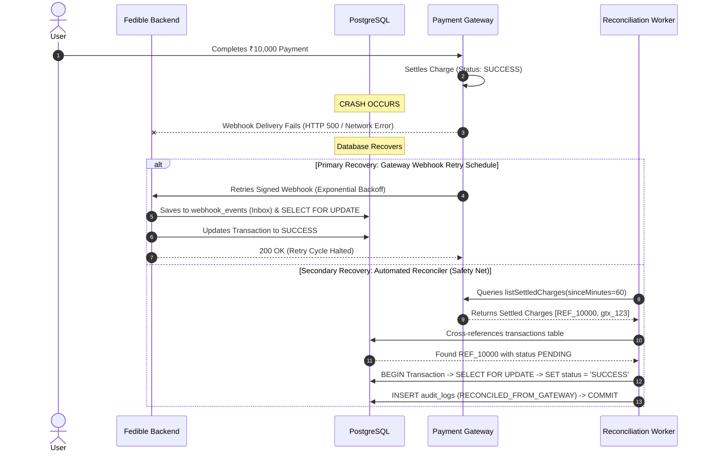

# Task 8: Distributed Failure Scenario & Crash Recovery

## 1. Failure Scenario Description
> **Scenario**: A user's ₹10,000 (1,000,000 paise) payment succeeds at the external payment gateway, but the Fedible database crashes before the transaction is recorded as `SUCCESS`.

### Failure Timeline:
1. User authorizes ₹10,000 payment on the payment gateway checkout.
2. The payment gateway charges the customer's bank account and transitions the gateway charge to `SETTLED` / `SUCCESS`.
3. The gateway attempts to deliver the webhook `POST /api/v1/webhooks/payment` to Fedible.
4. **Fedible's database crashes or undergoes a restart** before the webhook transaction commits.
5. In Fedible's database, the transaction remains stuck in `PENDING` (or is missing).

---

## 2. Distributed Recovery Architecture

To ensure the transaction is **neither lost nor duplicated**, we employ a primary delivery mechanism backed by a secondary reconciliation safety net:

---

## 3. Two-Tier Recovery Mechanisms

### Tier 1: Automated Gateway Webhook Retries (Primary)
Payment gateways retry failed webhook deliveries using exponential backoff (e.g., 5s, 1m, 15m, 1h, 6h, 24h).
- When the database recovers, subsequent webhook retries are received by `POST /api/v1/webhooks/payment`.
- The webhook handler uses the **Inbox Pattern** and `SELECT ... FOR UPDATE` to record the transaction idempotently without manual intervention.

---

### Tier 2: Automated Reconciliation Worker (Secondary Safety Net)
In the event that webhook retries are exhausted or dropped by upstream network firewalls:
1. **Scheduled Background Worker**: Runs periodically (e.g., every 15 minutes) or triggered on-demand via `POST /api/v1/payments/reconcile` (restricted to `ADMIN` role).
2. **Gateway Settlement Audit**: The worker calls the gateway's settlement API (`listSettledCharges`), retrieving all charges settled within the last time window.
3. **Discrepancy Identification**: Compares gateway records against internal PostgreSQL `transactions`.
4. **Autonomous Resolution**: For any transaction found in `PENDING` state:
   - Acquires a row lock (`SELECT FOR UPDATE`).
   - Updates status to `SUCCESS` with the official `gateway_tx_id`.
   - Records an immutable entry in `audit_logs` tagged `RECONCILED_FROM_GATEWAY` with details `{ reason: 'AUTO_RECONCILED_POST_CRASH' }`.

---

## 4. Concurrency & Non-Duplication Guarantee
Because all state updates (from both the webhook handler and the reconciliation worker) use **PostgreSQL row-level locking (`SELECT ... FOR UPDATE`)** and check that `status == 'PENDING'`, even if a webhook retry and the reconciliation worker run concurrently on the same transaction, exactly one process will transition the status, and the second will safely detect the terminal `SUCCESS` state and exit cleanly.
